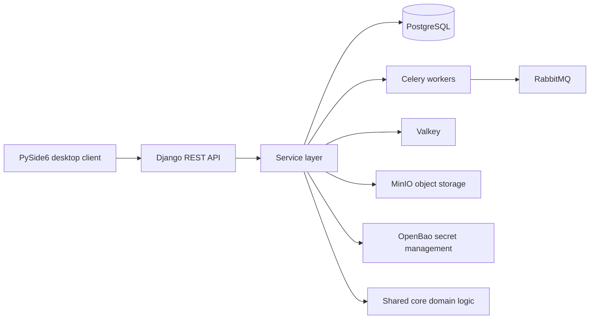

# ImmoApp Beta

ImmoApp is a multi-user desktop platform for real-estate agency operations. It combines a native PySide6 Windows client with a Django REST backend, PostgreSQL, asynchronous workers, object storage, secret management, and local-office deployment tooling.

> **Evaluation build:** this repository is published for technical, recruitment, and non-commercial software evaluation. It is not a production release and it is not a signed Windows installer.

## Quick evaluation on Windows

### Prerequisites

- **Windows 10 or 11**
- **Python 3.14**
- **Docker Desktop**, installed, running, and using its Linux engine
- Internet access on the first run so Python packages and Docker images can be downloaded

You do **not** need to create a virtual environment, edit `.env` files, configure PostgreSQL, configure OpenBao, or choose infrastructure passwords manually.

### Start with one double-click

1. Clone or download this repository and extract it to a normal writable folder.
2. Make sure Docker Desktop is running.
3. Double-click **`Start ImmoApp Beta.cmd`**. (If you have a potato PC/internet it should take around 20mn)

When the repository was downloaded as a ZIP, Windows can show an **Open File - Security Warning** for the unsigned `.cmd` launcher. Choose **Run** to continue. A verified publisher label requires a separately code-signed Windows executable/installer.

The launcher runs the Beta Quick Start and keeps the normal evaluator path out of PowerShell. On a fresh machine, Windows may display a standard UAC permission prompt once while the local runtime under `C:\ProgramData\ImmoApp` is prepared. After that elevated bootstrap finishes, the desktop application continues under the signed-in Windows user. If the prepared Python environments still match this repository and the runtime permissions are healthy, later starts skip that bootstrap/UAC step. After a successful start, the launcher window stays open as a small login reminder showing the local Beta credentials (`owner` / `admin`); the desktop client itself runs separately.

The evaluation launcher uses a stable Docker Compose project name and automatically discards an orphaned **local OpenBao development volume** when its matching token/unseal files are absent. This specifically makes interrupted setup attempts and clean-test resets safe to retry without manual Docker volume cleanup.

The first run can take several minutes because Docker images and Python packages must be downloaded and the local backend must be initialized.

### Demo login

```text
Username: owner
Password: admin
```

These are **local Beta demo credentials only**. They are created by the development database seed and are not production credentials.

### What the launcher does

The Quick Start automatically:

1. checks Python 3.14 and Docker Desktop;
2. creates isolated server and desktop-client Python environments when needed;
3. creates or repairs the host runtime and Windows permissions under `C:\ProgramData\ImmoApp`;
4. generates local-only infrastructure credentials;
5. starts PostgreSQL, RabbitMQ, Valkey, MinIO, ClamAV, OpenBao, Django, Celery workers, and the scheduler;
6. prepares the database and local demo account;
7. verifies `http://127.0.0.1:8000/api/v1/health/`;
8. launches the real PySide6 desktop client.

Local infrastructure secrets are generated on the evaluator's machine. They are not committed to the repository.

### Stop the local backend

Closing the desktop application leaves the Docker backend running so local state is available on the next start. Double-click **`Stop ImmoApp Beta.cmd`** to stop the local backend without deleting its data.

### Manual / diagnostic launch

The double-click launcher is the recommended evaluation path. For verbose troubleshooting, the same Quick Start can be run directly:

```powershell
powershell -NoProfile -ExecutionPolicy Bypass -File .\quickstart.ps1
```

The manual command keeps the client attached to the console so startup errors are easier to inspect. Runtime and application logs are stored under `C:\ProgramData\ImmoApp\logs`.

---

## Architecture



For the Beta Quick Start, the desktop client runs from an isolated Windows Python environment while the backend runs through Docker Desktop.

## Product scope

The application currently covers:

- clients and property requirements;
- property listings and property-demand matching;
- visits, contracts, and follow-up workflows;
- CSV, TSV, TXT, Excel, and ODS import;
- normalization, duplicate detection, and manual review of uncertain imports;
- role-aware multi-user access;
- local recovery, diagnostics, backup, and operational tooling.

## Engineering highlights

- Multi-user desktop/client-server architecture with tenant-aware server workflows.
- PostgreSQL row-level security, role-based authorization, audit trails, and AES-256-GCM protection for sensitive fields.
- Property-demand matching with indexed access paths, cache/rebuild workflows, and background execution.
- Resumable import and review workflows for heterogeneous agency data.
- Idempotent writes, optimistic concurrency, retry policies, circuit breakers, queued replay, health checks, and backup/restore tooling.
- Windows packaging and local-office deployment tooling using PyInstaller, Inno Setup, Docker, WSL2-oriented runtime tooling, and LAN discovery.
- **2,444 test functions across 440 test files** in this snapshot, including **54 native desktop end-to-end test functions**.
- TLA+ specifications for selected concurrency and isolation invariants.

## Technology

**Application:** Python, PySide6, Django, Django REST Framework  
**Data:** PostgreSQL, row-level security, Alembic  
**Async/cache:** Celery, RabbitMQ, Valkey  
**Security/operations:** OpenBao, Docker, Caddy, observability tooling  
**Quality:** pytest, mypy, Ruff, Black, pre-commit, GitHub Actions, TLA+

## Contract Seams

The repository keeps several generated or explicit references for the boundaries most likely to drift in a large client/server application:

- [API route reference](docs/reference/API_ROUTE_REFERENCE.md) reflects the registered `/api/v1/` surface owned by `server/api/route_registry.py`.
- [Schema authority](docs/reference/SCHEMA_AUTHORITY.md) records migration/schema ownership across the persistence layer.
- [Domain integration matrix](docs/reference/DOMAIN_INTEGRATION_MATRIX.md) maps critical long-path behavior to integration coverage.
- [Database table catalog](docs/reference/DB_TABLE_CATALOG.md) documents the current database surface.
- [API versioning and pagination policy](docs/reference/API_VERSIONING_PAGINATION_POLICY.md) documents public API compatibility rules.

These references complement the architecture documents rather than replacing executable tests.

## Repository layout

```text
Start ImmoApp Beta.cmd  Double-click evaluator launcher
Stop ImmoApp Beta.cmd   Stops the local Docker backend and keeps local data
quickstart.ps1           Automated local Beta setup and launch
app/                     PySide6 desktop client and desktop tests
server/                  Django API, services, migrations, background workflows
core/                    Shared domain logic, contracts, data access, importer, matcher
tests/                   Repository-level tests and performance tests
requirements/            Exact server/client dependency definitions
deployment/              Docker Compose, proxy, installer, and environment templates
scripts/                 Development, validation, build, and operations tools
docs/                    Architecture, security, schema, and runtime documentation
ops/                     Operational policies and runbooks
tools/                   Verification and supply-chain tooling
```

## Tests

Run the pull-request validation lane:

```powershell
powershell -NoProfile -ExecutionPolicy Bypass -File .\checks.ps1 -Stage pr
```

Run the broader validation lane:

```powershell
powershell -NoProfile -ExecutionPolicy Bypass -File .\checks.ps1 -Stage full
```

Run native Windows desktop E2E smoke tests:

```powershell
powershell -NoProfile -ExecutionPolicy Bypass -File .\scripts\test_e2e_desktop.ps1 -Suite smoke
```

GitHub Actions also contains CI, nightly-heavy, game-day, and TLA+ verification lanes.

## Security model for the evaluation build

The repository contains security-sensitive infrastructure and deployment code, but no evaluator-specific secrets should be committed. The Quick Start generates local infrastructure credentials on the evaluator's machine and stores runtime state outside the repository under `C:\ProgramData\ImmoApp`.

The desktop user's normal runtime areas, such as configuration, logs, cache, imports, local queues, and backups, are writable without running the application as Administrator. The bootstrap/identity path applies narrower handling to local secret material and retains SYSTEM/administrator recovery access.

The local `owner / admin` credentials exist only for the Beta seed path. They must not be interpreted as production defaults.

See [SECURITY.md](SECURITY.md) and [Authentication and security](docs/architecture/AUTH_AND_SECURITY.md).

## Advanced development and architecture

The one-click Quick Start is the recommended evaluator route. Contributors and technical reviewers can start with:

- [Documentation index](docs/README.md)
- [Clean-machine bootstrap](docs/guides/CLEAN_MACHINE_BOOTSTRAP.md)
- [Codebase map](docs/architecture/CODEBASE_MAP.md)
- [Runtime and data flows](docs/architecture/RUNTIME_AND_DATA_FLOWS.md)
- [Authentication and security](docs/architecture/AUTH_AND_SECURITY.md)
- [Matching and cache architecture](docs/architecture/MATCHING_AND_CACHE_ARCHITECTURE.md)
- [Importer architecture](docs/architecture/IMPORTER_ARCHITECTURE.md)
- [Database schema reference](docs/reference/DB_SCHEMA_REFERENCE.md)

The repository also contains managed-runtime, packaging, observability, recovery, and release-validation tooling. Those lower-level paths are engineering surfaces; they are not required for a normal local Beta evaluation.

## License

Copyright © 2026 Yacine Larbaoui. ImmoApp is **source-available for evaluation purposes** and is not open-source software.

The license permits inspection, cloning, building, running, and testing for personal technical review, recruitment or employment assessment, academic review of the software itself, and other non-commercial evaluation. Commercial or production use, redistribution, incorporation into another product, derivative products, and reuse of the code as a basis for developing other software require separate written permission.

See [LICENSE](LICENSE) for the complete terms.
